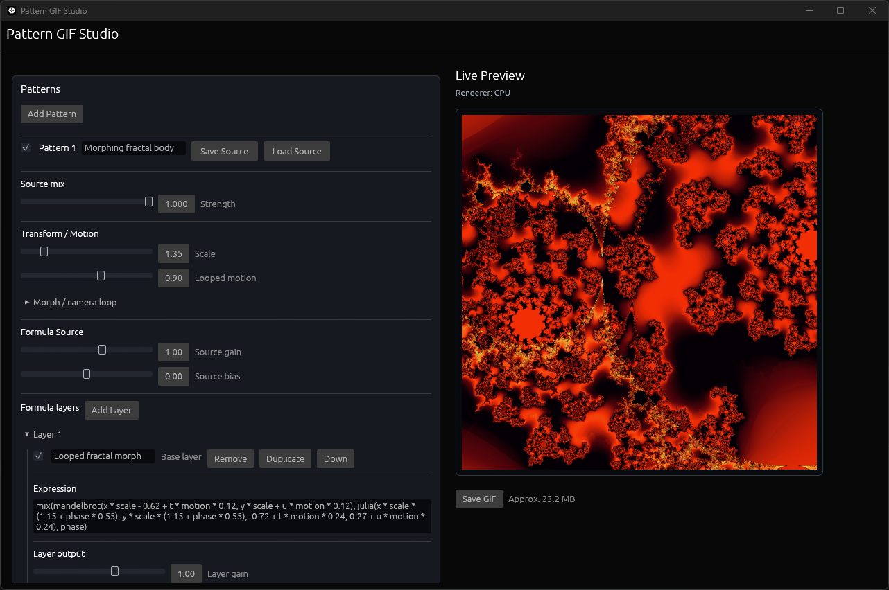
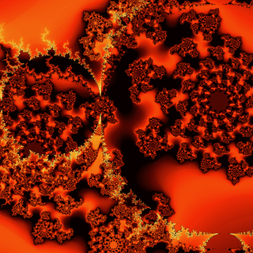
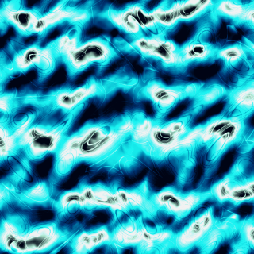
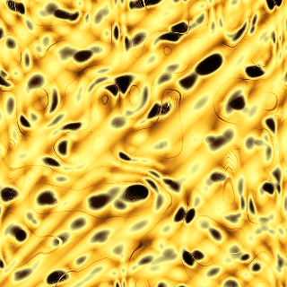
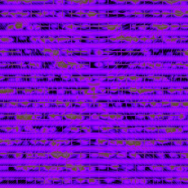

# Pattern GIF Studio

  

  
  
  
  

Pattern GIF Studio is a desktop application for designing seamless animated GIF loops from procedural pattern sources.
It combines formula layers, domain deformation, effect layers and animated palettes.

## Features

- Layered procedural pattern and effect composition.
- Formula sources with editable layers and domain deformation.
- Custom color gradients with animated transitions.
- Live preview and GIF export.
- Portable Windows build with bundled creative starting points.

## How to use

- Start from a workflow preset when exploring the overall look, or load pattern,
  effect and color sources when you only want to replace one part of a project.
- Set GIF size, FPS and duration before detailed tuning so the live preview
  matches the final framing and loop timing.
- Build the main structure in the pattern stack first, then use effects as
  modulation rather than as the base image.
- Use formula layers for local structure and the domain pipeline for coordinate
  deformation between layers.
- Tune colors after the motion and composition are readable.
- Save sources when a single pattern, effect or color set is reusable..

## License

This project is licensed under the MIT License. See the `LICENSE` file for details.
